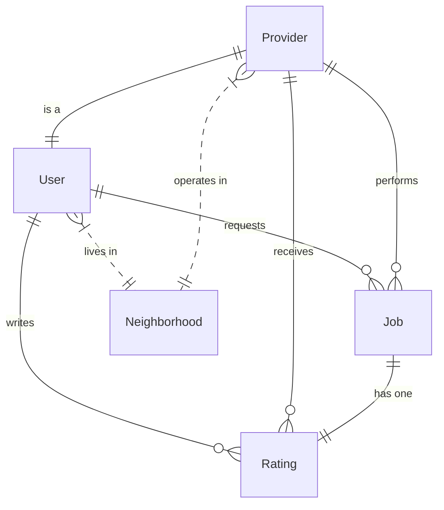

# 📘 Database Schema Reference

This document outlines the database schema for the Neighborhood Services platform.

## 👥 Collections & Models

### 1. User (`users`)

Represents an account on the platform. Can be a customer, a provider, or both.

| Field | Type | Required | Description |
|-------|------|----------|-------------|
| `userName` | String | Yes | Full name (2-100 chars) |
| `email` | String | Yes | Login email (Unique) |
| `password` | String | Yes | Hashed password |
| `phone` | String | Yes | Contact number |
| `neighborhoodID` | ObjectId | Yes | Ref: `Neighborhood` (Home location) |
| `isActive` | Boolean | No | Default: `true` |

### 2. Provider (`providers`)

Represents a service provider profile linked to a User.

| Field | Type | Required | Description |
|-------|------|----------|-------------|
| `userID` | ObjectId | Yes | Ref: `User` (Unique - 1 per user) |
| `serviceType` | String | Yes | Enum: `plumbing`, `electrical`, etc. |
| `description` | String | No | Bio/Service details (max 1000 chars) |
| `trustScore` | Number | No | Default: `0` (Calculated 0-5) |
| `verification` | Boolean | No | Default: `false` (Platform verified) |
| `neighborhoodID`| ObjectId | Yes | Ref: `Neighborhood` (Operating area) |

### 3. Job (`jobs`)

Represents a service request or completed work.

| Field | Type | Required | Description |
|-------|------|----------|-------------|
| `userID` | ObjectId | Yes | Ref: `User` (The Customer) |
| `providerID` | ObjectId | Yes | Ref: `Provider` (The Worker) |
| `status` | String | No | `pending`, `confirmed`, `completed`, `cancelled` |
| `price` | Number | No | Agreed price |
| `completedDate` | Date | No | When status becomes completed |

### 4. Rating (`ratings`)

Represents a review left by a User for a Job.

| Field | Type | Required | Description |
|-------|------|----------|-------------|
| `jobID` | ObjectId | Yes | Ref: `Job` (Unique - 1 rating per job) |
| `userID` | ObjectId | Yes | Ref: `User` (Reviewer) |
| `providerID` | ObjectId | Yes | Ref: `Provider` (Reviewee) |
| `reliability` | Number | Yes | 1-5 Scale |
| `punctuality` | Number | Yes | 1-5 Scale |
| `priceHonesty` | Number | Yes | 1-5 Scale |
| `comment` | String | No | Text review |

### 5. Neighborhood (`neighborhoods`)

Represents a location cluster.

| Field | Type | Required | Description |
|-------|------|----------|-------------|
| `name` | String | Yes | e.g., "Downtown" |
| `city` | String | No | e.g., "Metropolis" |

---

## 🔗 Key Relationships

## 🔄 Business Logic Rules

1. **Trust Score**: Calculated as average of (Reliability + Punctuality + PriceHonesty) across all ratings.
    * *Must be updated manually via API using `utils/trustScore.ts`.*
2. **Fake Review Prevention**: A `Rating` cannot exist without a valid `Job`.
3. **One Profile**: A `User` can have only one `Provider` profile.
